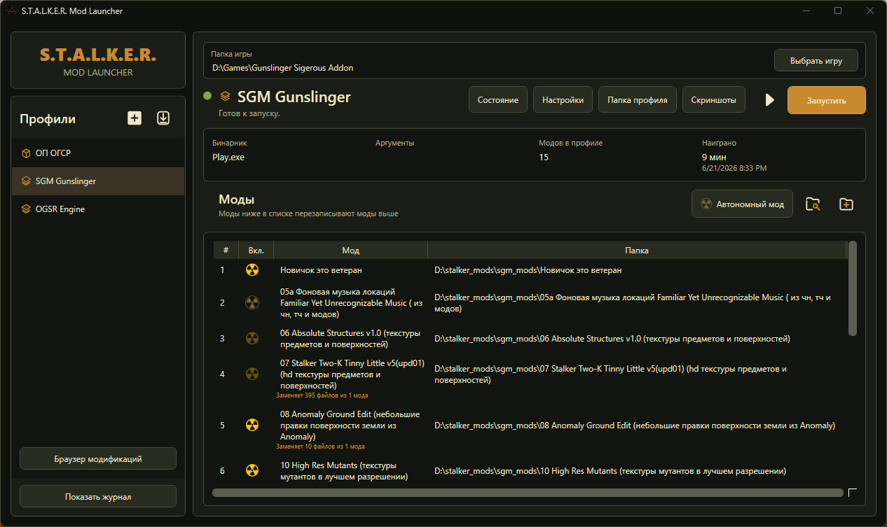
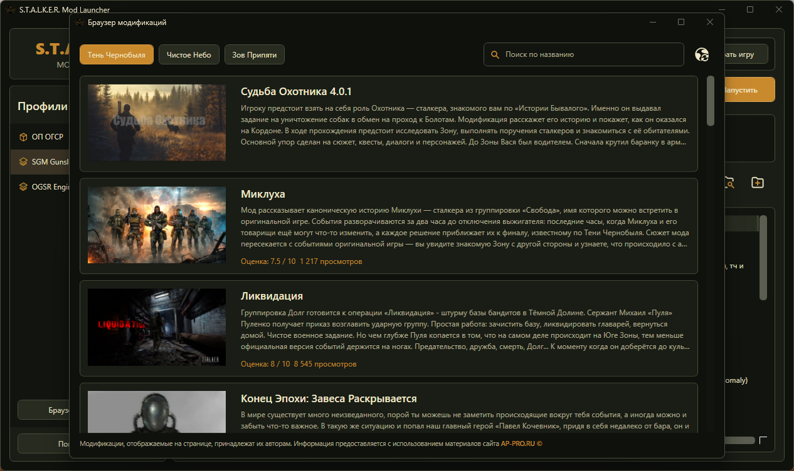

# S.T.A.L.K.E.R. Mod Launcher

<p align="center">
  
  
</p>

<p align="center">
  <a href="https://github.com/ITzSYUK/StalkerModLauncher/releases/latest"><strong>Download latest release / Скачать последний релиз</strong></a>
</p>

<p align="center">
  <a href="#english">English</a> | <a href="#russian">Русский</a>
</p>

---

<a id="english"></a>

## English

**S.T.A.L.K.E.R. Mod Launcher** is a Windows launcher for local S.T.A.L.K.E.R. mods and standalone X-Ray based builds.

It creates separate profiles, keeps saves/logs/settings isolated, and avoids changing the original game or mod folders. Regular profiles do not copy the whole game: the launcher connects source files with links, so profile workspaces usually take very little extra disk space.

### Features

- Regular profiles: base game plus one or more mod folders.
- Standalone profiles: ready-to-play builds with their own executable.
- Mod priority order with drag-and-drop.
- Automatic executable detection with manual override.
- Per-profile saves, logs, screenshots and workspace.
- Profile status, preflight checks, latest log and crash dump helpers.
- Import, export and duplicate profiles.
- Optional Discord Rich Presence.
- Built-in AP-PRO modification browser for Shadow of Chernobyl, Clear Sky and Call of Pripyat.

### Quick Start

1. Click **Create** and choose a profile type.
2. For a regular profile, select the base game folder and add mod folders.
3. For a standalone profile, select one root folder of the ready build.
4. Check the selected executable in profile settings.
5. Click **Launch**.

Mods lower in the list have higher priority and overwrite matching files from mods above them.

### Requirements

- Windows 10/11 x64.
- .NET 8 Desktop Runtime x64 for the framework-dependent release.
- .NET 8 SDK if you want to build from source.

### Build From Source

```powershell
dotnet build .\StalkerModLauncher.sln
dotnet test .\StalkerModLauncher.sln -c Release
dotnet run --project .\src\StalkerModLauncher\StalkerModLauncher.csproj
```

### Documentation

Technical notes about profiles, workspaces, file safety, settings and diagnostics are available in [docs/TECHNICAL.md](docs/TECHNICAL.md).

---

<a id="russian"></a>

## Русский

**S.T.A.L.K.E.R. Mod Launcher** — Windows-лаунчер для локальных модификаций S.T.A.L.K.E.R. и автономных сборок на базе X-Ray.

Лаунчер создаёт отдельные профили, изолирует сохранения, логи и настройки, а исходные папки игры и модов не изменяет. Создаваемые профили не копируют игру целиком: лаунчер подключает исходные файлы ссылками, поэтому обычно занимает минимум дополнительного места на диске.

### Возможности

- Обычные профили: базовая игра плюс одна или несколько папок модов.
- Автономные профили: готовые сборки со своим исполняемым файлом.
- Порядок модов с изменением через drag-and-drop.
- Автоматический поиск EXE с возможностью ручного выбора.
- Отдельные сохранения, логи, скриншоты и workspace для профиля.
- Проверка состояния профиля, preflight-проверки, последний лог и crash dump.
- Импорт, экспорт и копирование профилей.
- Необязательный Discord Rich Presence.
- Встроенный браузер модификаций AP-PRO для ТЧ, ЧН и ЗП.

### Быстрый старт

1. Нажмите **Создать** и выберите тип профиля.
2. Для обычного профиля укажите папку базовой игры и добавьте папки модов.
3. Для автономного профиля укажите одну корневую папку готовой сборки.
4. Проверьте выбранный EXE в настройках профиля.
5. Нажмите **Запустить**.

Моды ниже в списке имеют больший приоритет и перезаписывают совпадающие файлы модов выше.

### Требования

- Windows 10/11 x64.
- .NET 8 Desktop Runtime x64 для обычного релиза.
- .NET 8 SDK для сборки из исходного кода.

### Сборка из исходного кода

```powershell
dotnet build .\StalkerModLauncher.sln
dotnet test .\StalkerModLauncher.sln -c Release
dotnet run --project .\src\StalkerModLauncher\StalkerModLauncher.csproj
```

### Документация

Техническое описание профилей, workspace, безопасности файлов, настроек и диагностики находится в [docs/TECHNICAL.md](docs/TECHNICAL.md).

---

## License

The launcher source code is licensed under the [GNU GPLv3](LICENSE.md). Third-party assets keep their original licenses.
