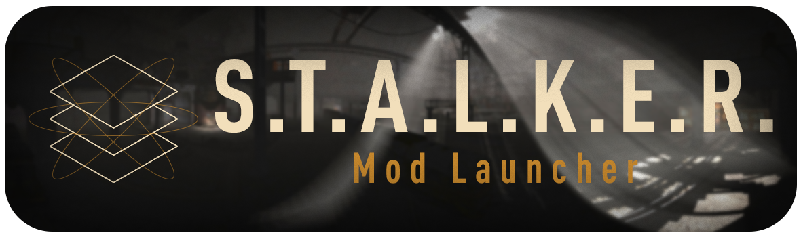

<p align="center">
  
</p>

|  |  |
| ---------------------------------------------------------- | -------------------------------------------------------------------- |

<p align="center">
  <a href="https://github.com/ITzSYUK/StalkerModLauncher/releases/latest"><strong>Download latest release</strong></a>
</p>

<p align="center">
  <a href="#english">English</a> | <a href="#russian">Русский</a>
</p>

---

<a id="english"></a>

## English

**S.T.A.L.K.E.R. Mod Launcher** is a Windows launcher for local S.T.A.L.K.E.R. modifications and standalone X-Ray builds. It keeps profiles, saves, logs and settings separate without modifying the original game or mod folders.

Regular profiles do not copy the whole game. The stable Workspace mode connects source files with NTFS links, while the experimental USVFS mode uses the virtual filesystem from Mod Organizer 2.

### Features

- Regular profiles: base game plus ordered mod folders.
- Standalone profiles for ready-to-play builds with their own executable.
- Drag-and-drop mod priority; lower entries overwrite matching files above.
- Automatic executable detection with a manual override.
- Isolated saves, logs, screenshots and settings per profile.
- Stable linked Workspace backend and experimental USVFS backend (x64 and x86).
- Profile preflight, workspace status, latest log and crash dump helpers.
- Profile import, export and duplication.
- AP-PRO modification browser for Shadow of Chernobyl, Clear Sky and Call of Pripyat.
- Optional Discord Rich Presence.

### Quick Start

1. Click **Create** and choose a regular or standalone profile.
2. Select the base game and mod folders, or one ready-to-play standalone folder.
3. Check the detected executable and mod order.
4. Keep **Workspace - stable** unless you intentionally want to test USVFS.
5. Click **Launch**.

### Release Packages

- `StalkerModLauncher.exe` requires the .NET 8 Desktop Runtime x64.
- `StalkerModLauncher-Standalone.exe` includes .NET and does not require a separate runtime.
- Experimental USVFS also requires the Microsoft Visual C++ 2015-2022 Redistributable for x64 and x86 games.

Windows 10/11 x64 is required. The .NET 8 SDK is required only when building from source.

### Build From Source

```powershell
dotnet build .\StalkerModLauncher.sln
dotnet test .\StalkerModLauncher.sln -c Release
dotnet run --project .\src\StalkerModLauncher\StalkerModLauncher.csproj
```

Architecture, workspace safety, USVFS, settings and release packaging are described in [docs/TECHNICAL_EN.md](https://github.com/ITzSYUK/StalkerModLauncher/blob/main/docs/TECHNICAL_EN.md).

---

<a id="russian"></a>

## Русский

**S.T.A.L.K.E.R. Mod Launcher** — Windows-лаунчер для локальных модификаций S.T.A.L.K.E.R. и автономных сборок на базе X-Ray. Он разделяет профили, сохранения, логи и настройки, не изменяя исходные папки игры и модов.

Создаваемые профили не копируют игру целиком. Стабильный режим Workspace подключает исходные файлы NTFS-ссылками, а экспериментальный USVFS использует виртуальную файловую систему Mod Organizer 2.

### Возможности

- Обычные профили: базовая игра и упорядоченный список папок модов.
- Автономные профили для готовых сборок со своим исполняемым файлом.
- Изменение приоритета модов перетаскиванием; нижние моды заменяют совпадающие файлы верхних.
- Автоматический поиск EXE с возможностью ручного выбора.
- Отдельные сохранения, логи, скриншоты и настройки каждого профиля.
- Стабильный backend Workspace и экспериментальный USVFS для x64 и x86.
- Проверка готовности профиля, состояние workspace, последний лог и crash dump.
- Импорт, экспорт и копирование профилей.
- Браузер модификаций AP-PRO для ТЧ, ЧН и ЗП.
- Необязательный Discord Rich Presence.

### Быстрый старт

1. Нажмите **Создать** и выберите обычный или автономный профиль.
2. Укажите базовую игру и папки модов либо одну папку готовой автономной сборки.
3. Проверьте найденный EXE и порядок модов.
4. Оставьте **Workspace — стабильный**, если не собираетесь осознанно тестировать USVFS.
5. Нажмите **Запустить**.

### Варианты релиза

- `StalkerModLauncher.exe` требует .NET 8 Desktop Runtime x64.
- `StalkerModLauncher-Standalone.exe` содержит .NET и не требует отдельной установки runtime.
- Для экспериментального USVFS также нужен Microsoft Visual C++ 2015-2022 Redistributable для запуска x64- и x86-игр.

Требуется Windows 10/11 x64. .NET 8 SDK нужен только для сборки из исходного кода.

### Сборка из исходного кода

```powershell
dotnet build .\StalkerModLauncher.sln
dotnet test .\StalkerModLauncher.sln -c Release
dotnet run --project .\src\StalkerModLauncher\StalkerModLauncher.csproj
```

Архитектура, безопасность workspace, USVFS, настройки и подготовка релиза описаны в [docs/TECHNICAL_RU.md](https://github.com/ITzSYUK/StalkerModLauncher/blob/main/docs/TECHNICAL_RU.md).

---

## License

The launcher source code is licensed under the [GNU GPLv3](LICENSE.md). Third-party components and assets retain their original licenses; see [THIRD_PARTY_NOTICES.md](THIRD_PARTY_NOTICES.md).
