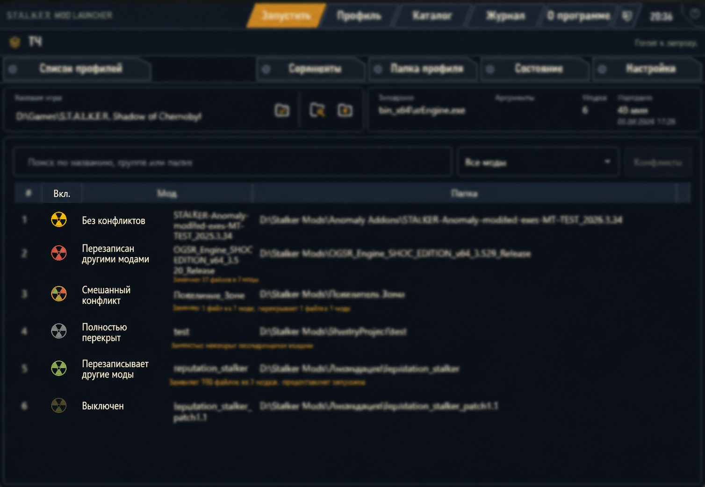

# Как перенести сборку из Mod Organizer 2

Мастер переноса создаёт новый профиль S.T.A.L.K.E.R. Mod Launcher из уже настроенного профиля MO2. Папки игры, модов и `overwrite` остаются на месте: лаунчер использует их только как источники и ничего в них не перезаписывает.

## Что переносится

- название профиля MO2;
- путь к базовой игре;
- папки модов;
- включённое и выключенное состояние;
- порядок и приоритет модов;
- группы, созданные разделителями MO2;
- содержимое `overwrite` — только если вы включите эту опцию вручную;
- EXE — только когда лаунчер может определить его надёжно.

Сохранения, `user.ltx` и параметры запуска MO2 автоматически не копируются. После импорта их можно перенести отдельно, если они действительно нужны сборке.

## Перед началом

Закройте MO2 и игру. Убедитесь, что сборка запускается из MO2 и что её папки не планируется переносить или удалять: созданный профиль будет ссылаться на них.

Для начала достаточно знать путь к одному из трёх мест:

- корневой папке MO2;
- папке нужного профиля внутри `MO2\profiles`;
- файлу `modlist.txt` нужного профиля.

## Шаг 1. Откройте мастер

Нажмите кнопку **MO2** рядом со списком профилей. В классическом интерфейсе откроется отдельное окно, а в интерфейсе КПК мастер появится внутри экрана КПК.

Выберите папку MO2 или конкретный `modlist.txt`. Лаунчер постарается найти:

- доступные профили MO2;
- папку `mods`;
- базовую игру;
- папку `overwrite`.

Проверьте найденные пути. Если MO2 использует нестандартное расположение папок, укажите правильные пути кнопками **Изменить**.

## Шаг 2. Выберите профиль MO2

Если профилей несколько, выберите нужный в списке **Профиль MO2**. Название можно изменить перед созданием профиля лаунчера.

Нажмите **Предпросмотр**. Лаунчер прочитает `modlist.txt`, сопоставит записи с физическими папками и преобразует приоритеты MO2 в своё правило: моды ниже в списке имеют больший приоритет.

## Шаг 3. Проверьте найденные моды

В предпросмотре показываются состояние, группа и папка каждого мода.

- **Найден** — папка определена однозначно и будет добавлена.
- **Папка отсутствует** — запись останется в отчёте, но не попадёт в профиль.
- **Выберите одну из нескольких папок** — найдено несколько похожих каталогов, поэтому лаунчер не будет угадывать за вас.

Неоднозначная строка подсвечивается. Откройте список в столбце **Папка** и выберите каталог, который действительно относится к этому моду. После выбора состояние изменится на **Выбрано вручную**, а подсветка исчезнет. Пока остаётся хотя бы одна неоднозначная строка, кнопка создания профиля недоступна.

## Шаг 4. Решите, нужен ли MO2 overwrite

`overwrite` — служебная папка MO2. В неё попадают файлы, созданные игрой или инструментами вне конкретного мода: конфиги, результаты генераторов и другие изменения.

Опция **Подключить файлы из MO2 overwrite отдельным слоем с максимальным приоритетом** по умолчанию выключена. Включайте её только тогда, когда сборка действительно зависит от содержимого `overwrite`. Этот слой получит максимальный приоритет, но не будет отображаться обычным модом в списке. Позже его можно отключить в настройках профиля.

## Шаг 5. Создайте и проверьте профиль

Нажмите **Создать профиль**. Операция выполняется целиком: если настройки не удалось сохранить, недоделанный профиль будет удалён, а мастер останется открытым.

После создания:

1. Проверьте путь к базовой игре и выбранный EXE.
2. Посмотрите порядок и состояние модов.
3. Сначала запустите сборку через стабильный режим **Workspace**.
4. При необходимости отдельно проверьте экспериментальный **USVFS**.
5. Только после успешного запуска переносите сохранения и `user.ltx`.

## Как читать значки конфликтов

Цвет знака радиации показывает, как файлы мода взаимодействуют с другими модами.

- жёлтый — конфликтов нет;
- зелёный — мод перезаписывает файлы модов выше;
- красный — его файлы перезаписаны модами ниже;
- разноцветный — мод одновременно перезаписывает другие файлы и сам частично перезаписан;
- серый — все полезные файлы мода перекрыты последующими модами;
- приглушённый — мод выключен.

Дважды щёлкните мод или нажмите **Конфликты**, чтобы увидеть конкретные файлы и цепочки замены. Исходные папки модов при этом не изменяются.

## Если нужен только старый импорт порядка

Команда **Применить только modlist.txt** в настройках профиля не переносит сборку. Она меняет порядок и состояние только тех модов, которые уже добавлены в профиль вручную. Для полноценного переноса используйте мастер **MO2**.

## Частые проблемы

### Базовая игра или mods не найдены

MO2 может хранить пути в нестандартном месте. Вернитесь на первый шаг и выберите папки вручную.

### Некоторые моды отсутствуют

Проверьте, что выбрана папка `mods` именно той установки MO2, к которой относится профиль. Удалённые или перенесённые каталоги мастер восстановить не сможет.

### После импорта сборка не запускается

Проверьте EXE, параметры запуска и необходимость `overwrite`. Сохранения и `user.ltx` не влияют на создание профиля, но некоторые готовые сборки могут ожидать собственные настройки. Сначала добейтесь запуска в Workspace, затем переходите к USVFS.

### Можно ли удалить MO2 после импорта

Нет, если моды остались в его папке `mods`. Лаунчер не копирует эти данные и продолжает использовать выбранные каталоги как источники.
